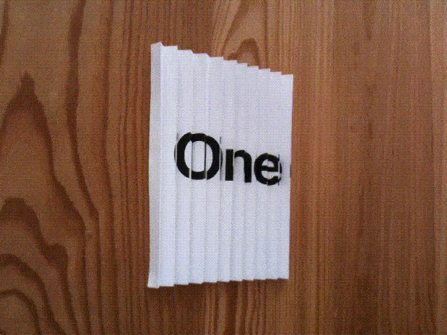

# Directions for Visualizing Concepts

*visualizing concepts* is a crucial part of most art/design projects. while it is widely understood that such visualizations are of grave relevance in the beginning of a work or project, it is worth noting that visualizations can and should play an important role over the course of the entire project depending on the *volatility* of the work and the context.

although this document refers to the notion of *visualizing* ( i.e regarding the visual sense ) it wants to imply forms of translations into other senses as well, for example:

- sonifications
- written words ( including narrative and poetic forms )
- (rapid) prototyping
- (re)enactments/performances

a *concept* in this context refers not only to concepts for works and projects but also extends to related topics such as:

- ideas
- plans
- notions
- thoughts
- theories
- suspicions ( @REF [Mark Lombardi](https://en.wikipedia.org/wiki/Mark_Lombardi) )
- models 
- actions

### Why Visualize Concepts and Why it Matters?

it has become a default to use concept visualizations in the beginning of a project to be able to communicate first ideas and make them discussible. regardless of whether this happens in the context of a client-contract situation, a university class or as part of an application for a grant.

in this context visualizations are tools for visual rethoric that aim to persuade, advertise and lure. it is important to realize and accept this. even the most neutral visualizations communicate on multiple levels, not just on the topic they visualize, and thereby say a lot about the way one works and how one creates a *public image*. visualization can and should be used strategically.

on the other hand visualization serve as important tools to communicate complex topics ( on a factual, emotional, rational and irrational level ). it is a quite epiphanic moment to see a group of recipents to react differently to a spoken description and a visualized explanation of an idea.

a random but nice example is the double pendulum. described in words "a double pendulum is a pendulum with another pendulum attached to its end". everybody knows what a pendulum does and can image what two connect pendula do. or can they? just observing the animation of a double pendulum evokes so many associations of a laid-back person.

 ( from Wikipedia: Double Compound Pendulum )

### A few Words on Visualizaton Style

> "another one for instagram", Henrik Nieratschker

visualization styles can be very neutral, conforming to industry or other standards ( e.g engineering blueprints or plain renderings ), or highly expressive and individualised. many develop their own visualization style that becomes part of their *brand* or identity ( this is often the case in achitecture or fashion, where projects might not go past the concept stage into production ). others develop new visualization styles for every project, fitting with the discussed themes and carrying the specific *vibe* of the work.

   

@caption(dennis p paul: rotierender-fernseher, although this is *just* a hand sketches it shows a specific *illustration* style which can be developed and cultivated into a recognizable *style*)

## Projects that are *only* Concept Visualizations

Some projects are *only* visualizations. This is often the case when the scope or scale make them unrealizable for the individual or team, or when the communication of the concept is more important than its realization. This might be called speculative.

### Examples

- [Étienne-Louis Boullée](https://en.wikipedia.org/wiki/%C3%89tienne-Louis_Boull%C3%A9e) -- visionary French neoclassical architect
- [Archigram](https://en.wikipedia.org/wiki/Archigram) -- British avantgarde architecture group 

## Works in Which Visualizations become Part of the Work

In other works, visualizations become an important *part* of the actual, final work. This can either happen during the process, by accident, or as a specific strategy.   

### Examples

- Matthew Barney: River of Fundament - [Drawings](https://www.gladstonegallery.com/artist/matthew-barney/work-detail/868/em-river-of-fundament-leaves-of-grass-em), [Movie](https://www.youtube.com/watch?v=quyiQXG7GlY) -- extensive art project including 2D works, sculptures and a feature film. As part of the production process, Barney created drawings that served as storyboards for the film and were later exhibited as artworks. 

## Words on *Resolution of a Visualization*

@todo(this needs to be elaborated)

- from hand sketch ( lo-res, lo-fi ) to 3D rendering ( hi-end, hi-fi )
- time + energy expended ( how much resources go into the visualization )
- strategically ( how much space do you leave for the recipient? )

## Methods + Strategies for Visualizing Concepts

There is a wide variety of methods and strategies that are suitable for visualization ( from napkin drawing to functional software sketch ). Each one has their specific time, situation and project that it is suitable for. 

Although visualizations are often thought as 2D entities on paper or screen, using other physical materials can be a effective way of visualizing concepts as well:

@caption(visualizing with materials)

Evaluating how to visualize at what stage in a project is key! Below are some example techniqes to consider:

- sketches
- photomontage
- collages
- moodboards
- renderings
- references e.g:
    - design/art works
    - inventions
    - research papers
    - patents
- mock-ups ( material + photo + video )
- video prototypes
- software sketches
- miniatures and models
- diagrams + schematics + blueprints
- proof-of-concepts
- tech demos
- physical and mechanical prototypes
    - lego
    - paper
- material tests
- wireframes
- storyboards

---

This document is available as a public document at [Directions for Visualizing Concepts](http://dm-hb.de/dmdfvc).

